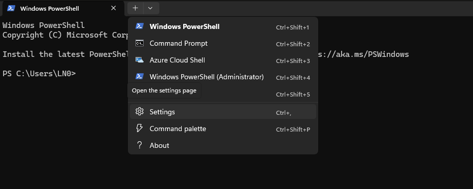
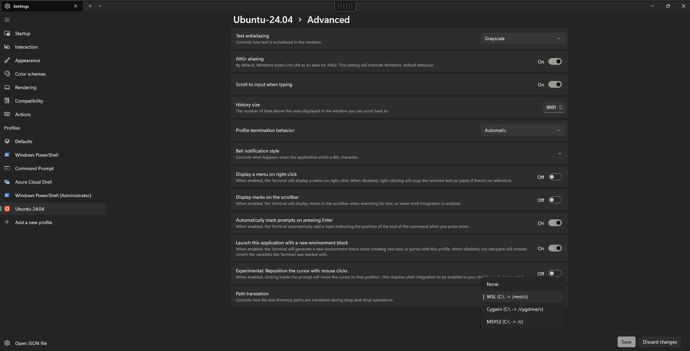
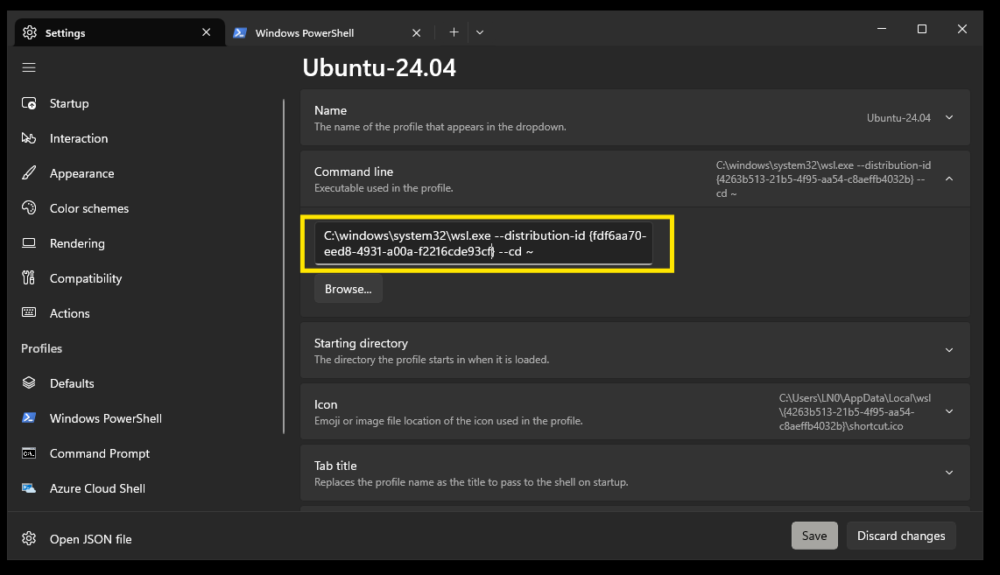
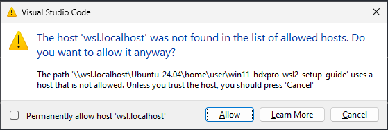

```

 _    _ _____ _      _____    __             _    _ _       __   __    _   _________   ________
| |  | /  ___| |    / __  \  / _|           | |  | (_)     /  | /  |  | | | |  _  \ \ / /| ___ \
| |  | \ `--.| |    `' / /' | |_ ___  _ __  | |  | |_ _ __ `| | `| |  | |_| | | | |\ V / | |_/ / __ ___
| |/\| |`--. \ |      / /   |  _/ _ \| '__| | |/\| | | '_ \ | |  | |  |  _  | | | |/   \ |  __/ '__/ _ \
\  /\  /\__/ / |____./ /___ | || (_) | |    \  /\  / | | | || |__| |_ | | | | |/ // /^\ \| |  | | | (_) |
 \/  \/\____/\_____/\_____/ |_| \___/|_|     \/  \/|_|_| |_\___/\___/ \_| |_/___/ \/   \/\_|  |_|  \___/

                        Maintained by: Julian Pereira
```

> Issues? Suggestions? Questions? Open an issue on [GitHub](https://github.com/pejulian/win11-hdxpro-wsl2-setup-guide/issues).
> Remember to check the [FAQ section](#tool-faq) for common issues and solutions.
> When creating an issue, please provide as much information as possible to help us assist you. Screenshots, command prompt dumps and error messages are all helpful.

# Windows 11 - WSL2 Setup Guide

This guide will walk you through how to set up your Windows 11 based HDXPro for development based on prevailing standards
in the Online Solutions department.

**DO NOT** jump to the install script unless you have followed the steps in [Operating System Settings](#operating-system-settings), [Setup WSL2](#setup-wsl2), [Terminal Setup](#terminal-setup) and [WSL Setup](#wsl-setup) sections.

> The script has been designed to work best on a fresh copy of VDI's Win 11 HDXPro.

## Operating System Settings

Before setting up anything, ensure that relevant operating system settings are enabled.

<details>
    <summary><b>You can "Run as Administrator"</b></summary>
    <br/>

Some operations in this install guide requires that you have the ability to "Run as Administrator".

</details>

<details>
    <summary><b>Enable Windows Features</b></summary>

<br/>

Open a Powershell prompt as administrator (locate the powershell icon in the Windows menu, right-click it and choose "Run as administrator").

Execute the following commands:

```powershell
Enable-WindowsOptionalFeature -Online -FeatureName "Microsoft-Hyper-V-All" -Source "SourcePath" -NoRestart
Enable-WindowsOptionalFeature -Online -FeatureName "VirtualMachinePlatform" -Source "SourcePath" -NoRestart
Enable-WindowsOptionalFeature -Online -FeatureName "HypervisorPlatform" -Source "SourcePath" -NoRestart
Enable-WindowsOptionalFeature -Online -FeatureName "Microsoft-Windows-Subsystem-Linux" -Source "SourcePath" -NoRestart
```

**RESTART** your machine.

</details>

<details>
    <summary><b>Install Terminal</b></summary>

<br/>

If you don't have it already, install `Terminal`, which is the preferred terminal application for this setup.

Go to [Terminal Releases](https://github.com/microsoft/terminal/releases) locate the `latest` release, expand the **Assets** dropdown
and download the asset ending with the extension `.msixbundle`. Run the file to install the application.

</details>

<details>
    <summary><b>Install Windows tools</b></summary>

<br/>

Some additional tools are required to be installed on Windows itself.

These tools facilitate functionality of Visual Studio Code (and other applications) when they are not running from inside WSL (e.g. git for windows).

1. Create a new file called `install-windows-tools.ps1` and save the contents of [this file](https://raw.github.com/pejulian/win11-hdxpro-wsl2-setup-guide/main/scripts/administration/install-windows-tools.ps1) in it.
2. Open Powershell **as Administrator** and navigate to where you have saved this file
3. Run this command: `Unblock-File -Path .\install-windows-tools.ps1`
4. Run the file using `.\install-windows-tools.ps1`
5. Close the shell

> If you need to undo this tooling installation, look at the [FAQ section](#tool-faq) for instructions.

</details>

<details>
    <summary><b>Install fonts</b></summary>
<br/>

For glyphs and icons to work properly, we will use the Meslo Nerd Font.

Steps:
1. Create a new file called `install-fonts.ps1` and save the contents of [this file](https://raw.github.com/pejulian/win11-hdxpro-wsl2-setup-guide/main/scripts/administration/install-fonts.ps1) in it.
2. Open Powershell **as Administrator** and navigate to where you have saved this file
3. Run this command: `Unblock-File -Path .\install-fonts.ps1`
4. Run the file using `.\install-fonts.ps1`
5. Close the **Terminal** application window (important!)

</details>

## Setup WSL2

<details>
    <summary><b>Create the file <code>.wslconfig</code> in <code>%USERPROFILE%</code></b></summary>

<br/>
    
Create the file `.wslconfig` in your home directory (type `%USERPROFILE%` in the explorer Window's navigation bar).


Add the following in this file:

```
[wsl2]
nestedVirtualization=false
guiApplications=false
memory=8GB
swap=4GB
```

> Reduce `memory` to less than 12GB if you have less than 32GB of RAM on your HDXPro.
> The configuration above assumes you have 24GB of RAM.

</details>

<details>
    <summary><b>Install WSL2</b></summary>

Run PowerShell as Administrator and run the following command:

```powershell
wsl --install Ubuntu-24.04 --web-download
```

This command installs Ubuntu 24.04 for WSL from an online source (GitHub) rather than from the Microsoft Store.

Run `wsl --status` and verify that the _default distribution_ is `Ubuntu-24.04` and the _default version_ is `2`.

Close Powershell.

</details>

## Terminal setup

<details>
    <summary><b>Terminal and profile settings</b></summary>
    <br/>

> If you get a warning in Terminal about not being able to load "Ubuntu Mono" font, you can safely ignore it.
> 
>  

Close and reopen the `Terminal` application if you had it open.

Open Settings (keyboard shortcut: `Ctrl + ,`):



A new profile should now be available in `Terminal`, named `Ubuntu-24.04`.

Change the default terminal to `Ubuntu-24.04`.


Remember to "Save" changes.

Open the `Ubuntu-24.04` profile from the sidebar on the left, expand Advanced and ensure that `Path translation` is set to `WSL`.



Expand the `Appearance` section and set the font to `MesloLGS NF`.

Expand the `Color` section and set the color scheme to `One Half Dark`. (_or anything you like really... I personally like this one_).

.

Remember to "Save" changes.

</details>

## WSL Setup

<details>
    <summary><b>Default Unix User</b></summary>
    <br/>

Open Terminal and ensure that you have the `Ubuntu-24.04` profile running (if you followed the steps above, this should be the default action that happens).

When you start `Ubuntu-24.04` for the first time, you will have to **create a Unix user account**.

Note that is **NOT THE SAME** as your Windows user account (even if you use the same user initials).

Use <b>any name</b> and <b>any password</b> you want but make sure to remember it as you will need it from time to time when running commands in `Ubuntu-24.04`:


The password chosen **IS NOT** the same and **DOES NOT** have to be the same as your Windows user password:


</details>

## WSL Image management

<details>
    <summary><b>Move WSL</b></summary>
    <br/>

At this point, it is critical to move the WSL image to the `DATA (D:)` drive.

By default, WSL creates images in the `C:` drive.

Moving the WSL image is important so that the WSL image does not use up
space on the `SYSTEM (C:)` drive and slow down the HDX Pro to the point of being
unusable as time goes by.

<b>Do this part in a new `Ubuntu-24.04` terminal window</b>

You will need to clone this repository (if not cloned already) to run relevant scripts needed to set up your WSL2 instance.

> `Ubuntu-24.04` should come pre-installed with `git`, `curl` and `wget`.
> You don't have to install them manually.

Open a new `Ubuntu-24.04` session tab in Terminal.

In your home folder (`cd $HOME`), clone the git repository (using HTTPS):

```bash
GIT_SSL_NO_VERIFY=1 git clone https://github.com/pejulian/win11-hdxpro-wsl2-setup-guide.git
```

<b>Do this part in a new Powershell terminal window</b>

Notes:

- The commands assume that the distribution name is `Ubuntu-24.04`.
- The commands assume that <b>user</b> is the name of your Unix user (<b>change it</b> to the username you set in [WSL Setup](#wsl-setup)).
- You <b>do not</b> need to run this command as Administrator.
- You have a folder called `Temp` created in the root of your `C:` drive (if you don't have it, just create it OR simply use any existing folder that you already have).
    - Remember to change the path (`C:\Temp`) in the commands below if you use a different folder.

```powershell
Copy-Item "\\wsl$\Ubuntu-24.04\home\user\win11-wsl2-setup-guide\scripts\administration\move-distro.ps1" "C:\Temp\move-distro.ps1"
```

```powershell
Unblock-File -Path "C:\Temp\move-distro.ps1"
```

```powershell
powershell.exe -ExecutionPolicy Bypass -File "C:\Temp\move-distro.ps1"
```

After the script has run, close the tab and open a new Powershell tab and paste the following:

```powershell
Get-ItemPropertyValue 'HKCU:HKEY_CURRENT_USER\SOFTWARE\Microsoft\Windows\CurrentVersion\Lxss' -Name DefaultDistribution
```

This will print the new ID of the `Ubuntu-24.04` distribution that has been moved t the `DATA (D:)` drive.


Use this to update the `Ubuntu-24.04` profile in your Termninal > Settings > Ubuntu-24.04 profile:



Don't forget to also update the "Icon" path for the profile:


Save the changes made and close Terminal.

When you reopen Terminal after this, the `Ubuntu-24.04` profile should load the WSL image from the `DATA (D:)` drive.

If you open `Terminal` and get the error "Encountered errors while loading user settings", where the error is regarding an "invalid icon", then simply repeat the step above to set the icon path on the `Ubuntu-24.04` profile and save the changes. Restart the terminal and it should work.


</details>

## Configuring the development environment

Before running any steps in this section, ensure that you have gone through the steps in the
[Operating System Settings](#operating-system-settings), [Setup WSL2](#setup-wsl2),
[Terminal Setup](#terminal-setup), [WSL Setup](#wsl-setup) and
[WSL Image Management](#wsl-image-management) sections.

<details>
    <summary><b>Install</b></summary>
    <br/>

If you haven't already, clone this repository to run relevant scripts needed to set up your WSL2 instance.

Navigate into where you cloned this repository before running the next steps.

Run the unattended installation script that will install the basic functionality
needed to establish the development environment:

```bash
chmod +x ./unattended-install.sh && \
./unattended-install.sh
```

Choose which type of installation you want:

1. Web Developer (This should sufficient for web developers)
2. Full (You need the full host of tools for extra use cases)


> Note that you may be **prompted for your Unix user password** _several_
> times during the installation process.
> The installation **WILL PAUSE** until you provide your Unix password.
> This _is not_ the same as your Windows user password.

The final part of the installation sets up an SSH and GPG key that will be used with
GitHub. The SSH key allows secure Git operations over SSH (`git@`) and the GPG key
will be used to sign commits for authenticity.

The installation will print the SSH and GPG keys it generates in the terminal.

> You must manually add the SSH and GPG keys to your GitHub account.

<br/>

[Link to Github keys settings page](https://github.com/settings/keys)

When you open a new `Ubuntu-24.04` terminal, you should see a welcome screen similar to this:


Test your SSH setup to ensure that it works:

```bash
ssh -T git@github.com
```


**NOTES FOR VSCODE**
This utility provides an automated install of VS Code Extensions that I use.

**IMPORTANT!**
This section also installs **REQUIRED** plugins so that you can run Visual Studio Code properly in WSL.

Open a new `Ubuntu-24.04` tab (it must be a new tab, _not the same one that installed Visual Studio Code_) and run the following:

```zsh
cd $HOME
cd win11-wsl2-setup-guide
./scripts/install/functions/vscode.sh packages
```

---

When opening VS Code for the first time, you will be prompted to add `wsl.localhost` to the list of allowed hosts.

Make sure to allow this:



---

**Manual setup for Github Copilot**

_Yes_, I can't automate all of it for you...

Follow [these steps](https://code.visualstudio.com/docs/copilot/setup-simplified) to set it up.

The user that you sign in with should be your **github.com** account!

---

**What is installed in the "Web Developer" Edition**

1. ZSH
2. Python 3
3. AWS CLI (v2)
4. NVM
5. PNPM
6. Yarn
7. Google Chrome (for automated testing)
8. Visual Studio Code (VS Code)

**What is installed in the "Full" Edition**

1. ZSH
2. Python 3
3. Rust
4. Ruby
5. AWS CLI (v2)
6. NVM
7. Docker
8. PNPM
9. Yarn
10. Google Chrome (for automated testing)
11. Java (openjdk)
12. Maven
13. Visual Studio Code (VS Code)

</details>

<details>
    <summary><b>Uninstall</b></summary>
    <br/>

If you haven't already, clone this repository to run relevant scripts needed to set up your WSL2 instance.

If your environment becomes a mess, you can restore it to a clean
state by running the following command:

```bash
sudo chmod +x ./unattended-uninstall.sh && \
./unattended-uninstall.sh
```

This attempts to remove all installed packages configuration files
from the system.

> Note that you may be **prompted for your Unix user password** several
> times during this process.
> The installation **WILL PAUSE** until you provide your Unix password.
> This _is not_ the same as your Windows user password.

At the end of this process, if everything is removed properly, the terminal
may start printing `zsh-autocomplete` related errors. This is perfectly fine
as `oh-my-zsh` and all related plugins have been removed, causing the current
shell to become unusable. Simply close the shell and reopen a new one to continue.

</details>

## Tool FAQ

<details>
    <summary><b>How to install (or uninstall) just one tool?</b></summary>
    <br/>

If you want to install or uninstall just one tool, you can do so by
running the relevant script in the `scripts/{install,uninstall}` folder.

**What tools can I install or uninstall?**
1. Look into [this folder](./scripts/install/functions/) for the list of available tools to install.
2. Look into [this folder](./scripts/uninstall/functions/) for the list of available tools to uninstall.

First of all, make all scripts executable:

```bash
sudo find ./scripts -type f -name "*.sh" -exec chmod +x {} \;
```

Then you can run the script for the tool you want to install or uninstall.

For example, if you want to **uninstall nodejs**, you can run the following command:

```bash
./scripts/uninstall/functions/node.sh
```

If you want to **install nodejs**, you can run the following command:

```bash
./scripts/install/functions/node.sh
```

</details>

<details>
    <summary><b>How to uninstall Windows tools?</b></summary>

<br/>

> WARNING: This will remove ALL packages installed via `chocolatey` as well as `chocolatey` itself.

If you want to uninstall the Windows tools, you can run the following steps:

1. Create a new file called `uninstall-windows-tools.ps1` and save the contents of [this file](https://raw.github.com/pejulian/win11-hdxpro-wsl2-setup-guide/main/scripts/administration/uninstall-windows-tools.ps1) in it.
2. Open Powershell **as Administrator** and navigate to where you have saved this file
3. Run this command: `Unblock-File -Path .\uninstall-windows-tools.ps1`
4. Run the file using `.\uninstall-windows-tools.ps1`
5. Close the shell

</details>

